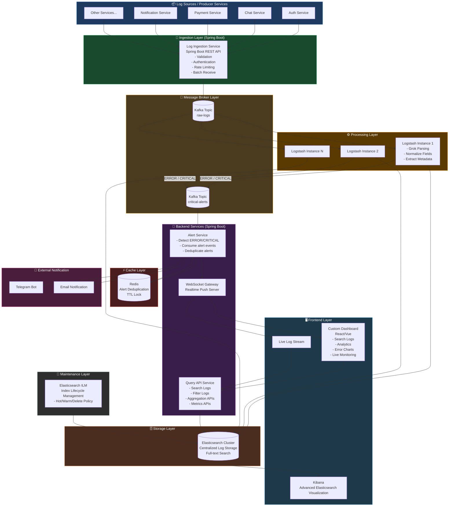

```mermaid
flowchart TD

    %% =========================
    %% LOG PRODUCERS
    %% =========================
    subgraph SOURCES["📦 Log Sources / Producer Services"]
        A1[Auth Service]
        A2[Chat Service]
        A3[Payment Service] 
        A4[Notification Service]
        AN[Other Services...]
    end

 
    %% =========================
    %% INGESTION LAYER
    %% =========================
    subgraph INGEST["🚀 Ingestion Layer (Spring Boot)"]
        API[Log Ingestion Service\nSpring Boot REST API\n- Validation\n- Authentication\n- Rate Limiting\n- Batch Receive]
    end


    %% =========================
    %% MESSAGE BROKER
    %% =========================
    subgraph MQ["📨 Message Broker Layer"]
        KAFKA1[(Kafka Topic\nraw-logs)]
        KAFKA2[(Kafka Topic\ncritical-alerts)]
    end

    %% =========================
    %% PROCESSING LAYER
    %% =========================
    subgraph PROCESS["⚙️ Processing Layer"]
        LS1[Logstash Instance 1\n- Grok Parsing\n- Normalize Fields\n- Extract Metadata]
        LS2[Logstash Instance 2]
        LS3[Logstash Instance N]
    end


    %% =========================
    %% STORAGE LAYER
    %% =========================
    subgraph STORAGE["🗄️ Storage Layer"]
        ES[(Elasticsearch Cluster\nCentralized Log Storage\nFull-text Search)]
    end


    %% =========================
    %% CACHE LAYER
    %% =========================
    subgraph CACHE["⚡ Cache Layer"]
        REDIS[(Redis\nAlert Deduplication\nTTL Lock)]
    end


    %% =========================
    %% ALERT / QUERY SERVICE
    %% =========================
    subgraph BACKEND["🧠 Backend Services (Spring Boot)"]

        QUERY[Query API Service\n- Search Logs\n- Filter Logs\n- Aggregation APIs\n- Metrics APIs]

        ALERT[Alert Service\n- Detect ERROR/CRITICAL\n- Consume alert events\n- Deduplicate alerts]

        WS[WebSocket Gateway\nRealtime Push Server]

    end


    %% =========================
    %% EXTERNAL NOTIFICATION
    %% =========================
    subgraph EXTERNAL["📢 External Notification"]
        TG[Telegram Bot]
        EMAIL[Email Notification]
    end


    %% =========================
    %% FRONTEND
    %% =========================
    subgraph FRONTEND["🖥️ Frontend Layer"]

        REACT[Custom Dashboard\nReact/Vue\n- Search Logs\n- Analytics\n- Error Charts\n- Live Monitoring]

        LIVE[Live Log Stream]

        KIBANA[Kibana\nAdvanced Elasticsearch Visualization]

    end


    %% =========================
    %% MAINTENANCE
    %% =========================
    subgraph MAINTENANCE["🧹 Maintenance Layer"]

        ILM[Elasticsearch ILM\nIndex Lifecycle Management\n- Hot/Warm/Delete Policy]

    end


    %% =========================
    %% FLOW
    %% =========================

    A1 --> API
    A2 --> API
    A3 --> API
    A4 --> API
    AN --> API

    API --> KAFKA1

    KAFKA1 --> LS1
    KAFKA1 --> LS2
    KAFKA1 --> LS3

    LS1 --> ES
    LS2 --> ES
    LS3 --> ES

    LS1 -- "ERROR / CRITICAL" --> KAFKA2
    LS2 -- "ERROR / CRITICAL" --> KAFKA2

    KAFKA2 --> ALERT

    ALERT --> REDIS
    REDIS --> ALERT

    ALERT --> TG
    ALERT --> EMAIL
    ALERT --> WS

    WS --> REACT
    WS --> LIVE

    QUERY --> ES

    REACT --> QUERY
    LIVE --> QUERY

    ES --> KIBANA

    ILM --> ES


    %% =========================
    %% COLORS
    %% =========================

    style SOURCES fill:#1e3a5f,color:#fff,stroke:#4a90d9
    style INGEST fill:#1a4a2e,color:#fff,stroke:#27ae60
    style MQ fill:#4a3a1e,color:#fff,stroke:#f39c12
    style PROCESS fill:#5a3a00,color:#fff,stroke:#ff9f00
    style STORAGE fill:#4a2d1e,color:#fff,stroke:#d9844a
    style CACHE fill:#4a1e1e,color:#fff,stroke:#e74c3c
    style BACKEND fill:#3a1e4a,color:#fff,stroke:#9b59b6
    style FRONTEND fill:#1e3a4a,color:#fff,stroke:#3498db
    style EXTERNAL fill:#4a1e3a,color:#fff,stroke:#e84393
    style MAINTENANCE fill:#2e2e2e,color:#fff,stroke:#95a5a6 
```